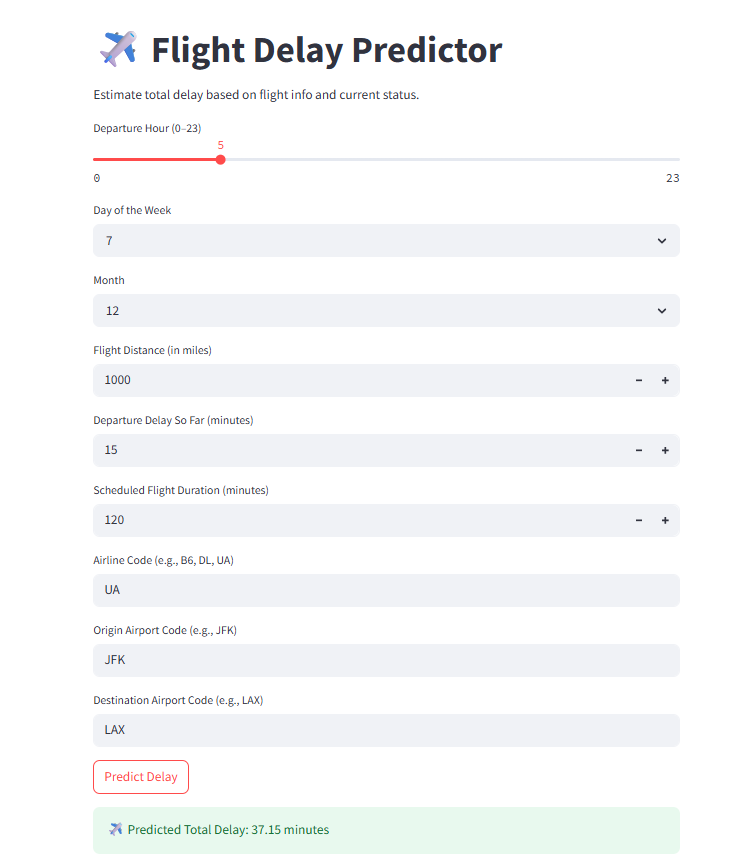

## ✈️ Flight Delay Predictor – Data-Driven Analysis & Prediction

A real-world project using a 1.9M-row U.S. flight dataset to explore delay patterns, identify key causes, and build a predictive system using Random Forest — now deployed with an interactive Streamlit app.

### 📊 Objectives

* Analyze delays by **hour, weekday, month, airline, airport, and distance**
* Identify **top delay causes** for most delayed airlines
* Map **airport and airline codes** to readable names
* Build and deploy a **Random Forest model** to predict total delay

### 🔍 Key Insights

* Flights after **5 PM** tend to have higher delays due to cascading schedule shifts.
* **JetBlue Airways** had the highest average delays, mostly from **late-arriving aircraft**.
* Peak delays in **December and July** (likely holiday-related); lowest in September–October.
* **Regional airports** like CMX, ACY, and PLN showed unexpectedly high average delays.
* Final **Random Forest model** achieved:

  * ✅ **R² Score:** 0.969
  * ✅ **RMSE:** \~17.7 minutes

### 🤖 Live App (Streamlit)

Predict delay in real time based on flight input:

> 🟢 [Try the app](https://flight-delay-analysis-lg65kidlefgbzougratjre.streamlit.app/) 

#### 📷 Screenshot

---

### 🛠️ Tools & Technologies

* **Python:** pandas, seaborn, scikit-learn, matplotlib
* **ML Model:** Random Forest Regressor
* **Web App:** Streamlit
* **Persistence:** joblib
* **Notebook:** Jupyter for full analysis & modeling

---

### 🧪 Files in This Repo

| File                          | Description                      |
| ----------------------------- | -------------------------------- |
| `Flight_Delay_Analysis.ipynb` | Full EDA, modeling, evaluation   |
| `app.py`                      | Streamlit app source             |
| `flight_delay_rf_model.pkl`   | Trained model (joblib)           |
| `model_features.pkl`          | Feature list for safe prediction |
| `README.md`                   | You’re reading it                |
| `streamlit app screenshot.png`       | Streamlit UI preview (optional)  |

---

### 🔗 Dataset

* Source: U.S. Department of Transportation
* 📦 [`DelayedFlights.csv`](https://www.kaggle.com/datasets/usdot/flight-delays)

---

### 📌 Future Work

* Improve model with additional features (e.g., weather, holiday flag)
* Deploy on cloud (Streamlit Cloud / AWS)
* Add airline-specific forecasting modules
* Option to explain delay causes based on input (e.g., Late Aircraft vs Weather)

---

### 🧠 Author

Kulsoom Banu Shaik
[GitHub](https://github.com/KulsoomBanu5) • [LinkedIn](https://www.linkedin.com/in/kulsoom-banu-8700a4259/)

